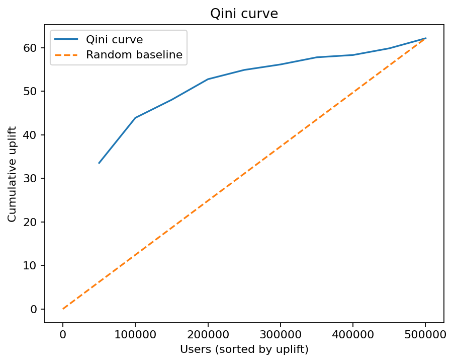
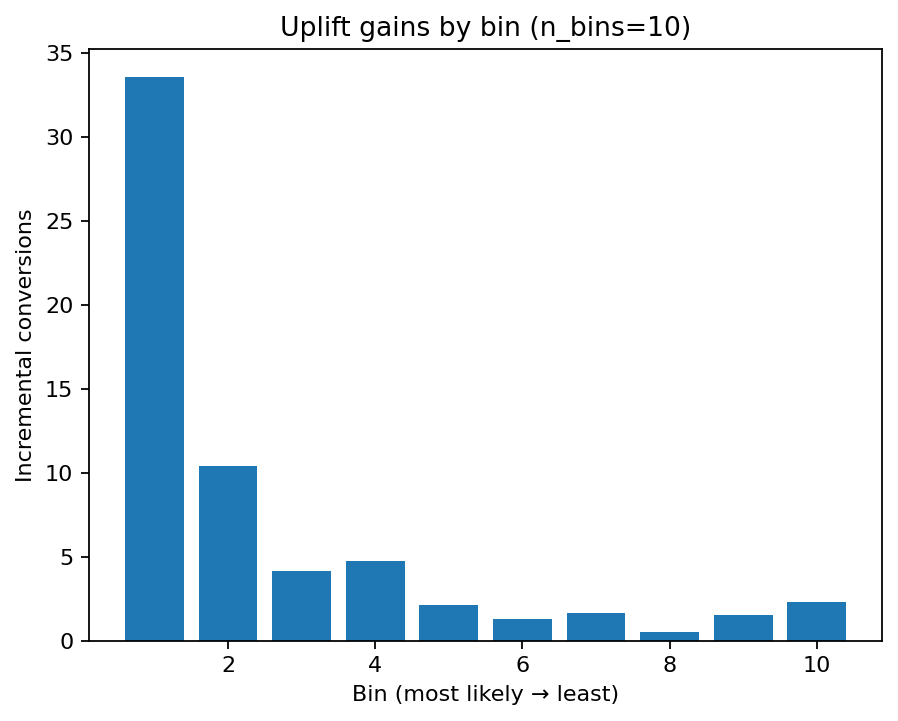
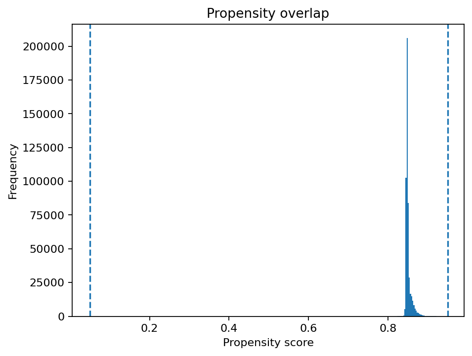

# AB Uplift Analysis (Python)

**What this shows:** end‑to‑end uplift modeling for A/B testing — from data prep and power checks to causal effect estimates (Primary, **CUPAC**, **IPW/AIPW**) and targeting quality via **Qini/AUUC** with a **Top‑K policy**.  
Engineered as a small Python package with a reproducible CLI, clean repo layout, and a narrative notebook.

---

## Highlights (why this is relevant)
- **Business focus:** turns experiment results into *who to target* next via Qini/AUUC & Top‑K policy.
- **Causal methods:** CUPAC adjustment plus IPW/AIPW estimators with CIs & overlap diagnostics (ESS, propensity).
- **Reproducible engineering:** `src/` package, console script (`ab-uplift-run`), deterministic seeds, saved reports/figures.
- **Zero‑friction review:** executed notebook with outputs, tiny sample dataset, and demo mode.

---

## Results preview

<p float="left">
  
  
</p>

*Propensity overlap:*  


> See full figures and tables at (`notebook/ab_results.ipynb`) 

---

## Quickstart

### 1) Set up
```bash
# macOS / Linux
python3 -m venv .venv && source .venv/bin/activate
pip install -e .
pip install pytest

# Windows (Command Prompt)
python -m venv .venv
.\.venv\Scripts\Activate.ps1
pip install -e .
pip install pytest
```

### 2) Run the pipeline

**A. Fully synthetic demo (no files needed)**
```bash
ab-uplift-run --demo
```

**B. Full dataset (optional)**
```bash
# Place the parquet under data/ then run:
ab-uplift-run --data data/criteo-uplift-v2.1.parquet --rows 500000 --bins 10
```

> You can find `full data set` at https://www.kaggle.com/datasets/arashnic/uplift-modeling


> Flags: `--rows` limits processed rows for speed; `--bins` controls uplift gains histogram bins

---

## What gets produced

**reports/tables/**
- `power_summary.csv` – power / detectable effect sanity
- `primary_effect_summary.csv` – diff‑in‑proportions & odds ratio (CIs)
- `smd_table.csv` – covariate balance (SMDs)
- `cupac_summary_gbm.csv` – adjusted effect with CUPAC baseline fit
- `ipw_aipw_summary.csv` – IPW/AIPW ATEs with CIs, effective sample size & propensity diagnostics
- `uplift_qini_gains.csv` – cumulative Qini by top‑k proportion
- `uplift_qini_meta.csv` – Qini total (@100%) and AUUC
- `uplift_topk_policy.csv` – recommended Top‑K targeting checkpoints

**reports/figures/**
- `qini_curve.png` – cumulative uplift vs random baseline
- `uplift_gains_by_bin.png` – incremental conversions by uplift decile/bin
- `propensity_hist.png` – overlap / propensity distribution (with cutoffs)

---

## Notebook
- Open **`notebook/ab_results.ipynb`** for a narrative summary (effects, balance, Qini/AUUC, Top‑K).  
- An **Appendix (ROI scenario)** lets you enter custom *value per conversion* and *contact cost per user* to see optimal economic strategy

---

## Repo structure
```
assets/                         # static screenshots from full dataset
data/                           # download from official source to use
notebook/                       # ab_results.ipynb, ab_results.html 
reports/{figures,tables}/       # generated figures and screenhots from full dataset
scripts/{run_all.py}            # Script to run all packages
src/ab_uplift/                  # package (cli, loaders, stats, models)
```

---

## Engineering notes
- `ab-uplift-run` is exposed via `pyproject.toml` as a console script.  
- Standard `src/` layout (`setuptools.find(where=["src"])`).
- Optional CI workflow (`.github/workflows/ci.yml`) runs `pytest` on push/PR.
- `--demo` path uses an in‑memory generator; no external data required.

---

## License & data
Code: see `LICENSE`.  
Dataset: the Criteo Uplift dataset is available separately under **Apache‑2.0** and is not shipped here.

---
